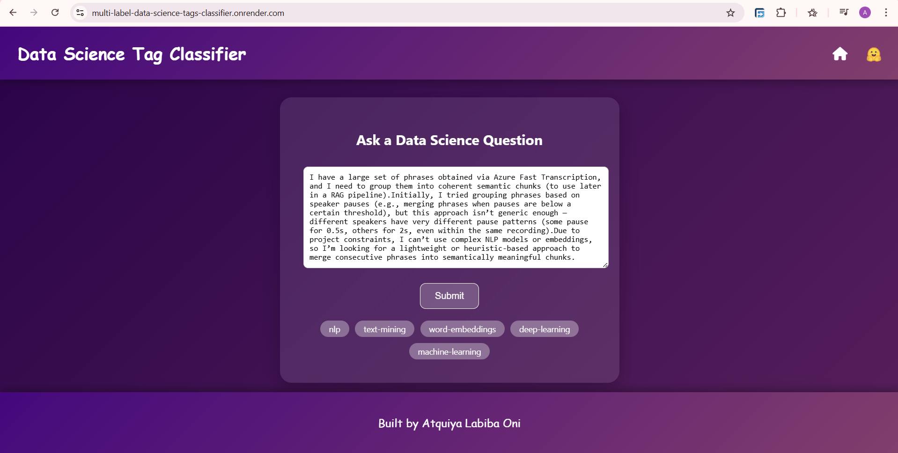

# MultiLabel Data Science Tags Classification
A multi-label text classification model from data collection, model training and deployment. The model can classify **299** different types of data science question tags from [here](https://datascience.stackexchange.com/questions). The keys of `tag_types_encoded.json` shows the list of all question tags.

## Web Deployment
Developed a Flask Webapp and deployed to Render. It takes data science questions as input and classifies the relevant tags associated with the question via HuggingFace API. Check out the web app from [here](https://multi-label-data-science-tags-classifier.onrender.com).

