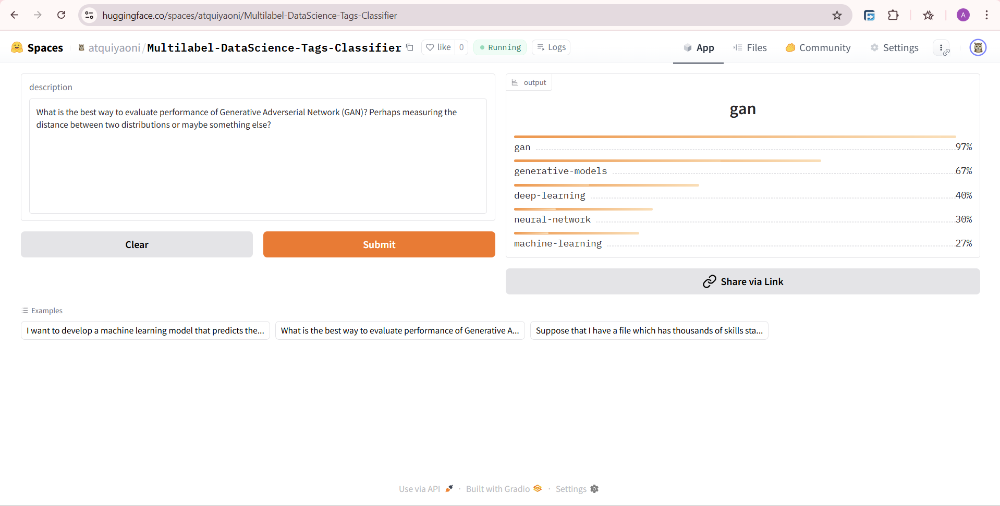

# MultiLabel Data Science Tags Classification
## Overview
A multi-label text classification model that predicts relevant tags for Data Science questions.The model can classify **299** types of question tags from [here](https://datascience.stackexchange.com/).

## Data Collection and Preprocessing
Data was collected from [here](https://datascience.stackexchange.com/) in two steps.

1. **Question URLs Scraping:** The datascience question URLs and their corresponding titles were scraped using the script [this notebook](/scraper/question_url_scraper.py). The dataset is available [here](/data/ques_urls.csv).
2. **Question Details Scraping:** For each URL listed in `ques_urls.csv` the question details (title, URL, description, tags) were scraped with [this notebook](/scraper/question_details_scraper.py). The complete dataset is stored in [here](/data/ques_details.csv).

In total, **24,500** datascience question details were scraped.

Initially, there were 692 different question tags in the dataset. After analysis, 393 rare tags—those appearing in less than 0.1% of questions were found.Rare tags and any questions that contained only these tags were removed from the dataset. Finally, the dataset had **299** different tags across **24,340** questions.

## Model Training and ONNX Inference
Three models were trained and later compressed using ONNX. The table below summarizes the key performance metrics for both the original and compressed models.

<table>
<tr>
    <th>Metric</th>
    <th>distilroberta-base</th>
    <th>distilroberta-base (quantized)</th>
    <th>roberta-base</th>
    <th>roberta-base (quantized)</th>
    <th>bert-base-uncased</th>
    <th>bert-base-uncased (quantized)</th>
</tr>
<tr>
    <th>Precision (Micro)</th>
    <td>0.654</td>
    <td>0.652</td>
    <td>0.658</td>
    <td>0.668</td>
    <td>0.655</td>
    <td>0.698</td>
</tr>
<tr>
    <th>Precision (Macro)</th>
    <td>0.308</td>
    <td>0.291</td>
    <td>0.280</td>
    <td>0.289</td>
    <td>0.283</td>
    <td>0.223</td>
</tr>
<tr>
    <th>Recall (Micro)</th>
    <td>0.304</td>
    <td>0.303</td>
    <td>0.302</td>
    <td>0.294</td>
    <td>0.300</td>
    <td>0.198</td>
</tr>
<tr>
    <th>Recall (Macro)</th>
    <td>0.151</td>
    <td>0.146</td>
    <td>0.136</td>
    <td>0.130</td>
    <td>0.139</td>
    <td>0.075</td>
</tr>
<tr>
    <th>F1 Score (Micro)</th>
    <td>0.415</td>
    <td>0.414</td>
    <td>0.414</td>
    <td>0.409</td>
    <td>0.411</td>
    <td>0.308</td>
</tr>
<tr>
    <th>F1 Score (Macro)</th>
    <td>0.184</td>
    <td>0.179</td>
    <td>0.169</td>
    <td>0.163</td>
    <td>0.170</td>
    <td>0.103</td>
</tr>
<tr>
    <th>Size</th>
    <td>314.3 MB</td>
    <td>79 MB</td>
    <td>476.6 MB</td>
    <td>129.9 MB</td>
    <td>418.8 MB</td>
    <td>105.4 MB</td>
</tr>
</table>

## Model Deployment
The distilroberta-base model outperformed other models and achieved 98% accuracy and F1-Score(Micro) of 42%. Hence this model was deployed to HuggingFace Spaces Gradio App. The implementation can be found in [deployment](/deployment/) or [here](https://huggingface.co/spaces/atquiyaoni/Multilabel-DataScience-Tags-Classifier).



## 🌐 Web Deployment

Developed a Flask Webapp and deployed to Render. It takes data science questions as input and classifies the relevant tags associated with the question via HuggingFace API. Check out the web app from [here](https://multi-label-data-science-tags-classifier.onrender.com/).


## Build from Source

1. Clone the repo

```bash
git clone https://github.com/Atquiya-Labiba/MultiLabel-Data-Science-Tags-Classifier.git
```

2. Initialize and activate virtual environment

```bash
python -m venv venv
venv\Scripts\activate
```

3. Install dependencies

```bash
pip install -r requirements.txt
```

## Run the Selenium Scraper

```bash
python scraper/question_url_scraper.py
```
## Scrape Question Details

```bash
python scraper/question_details_scraper.py
```

## Contact

[Email Me](mailto:atquiyaoni@gmail.com)
